# 🤖 AI Appointment Booking System

> An intelligent automation that books appointments from Google Sheets to Google Calendar — checking availability, creating events, and sending emails automatically.

## 🎬 See It In Action

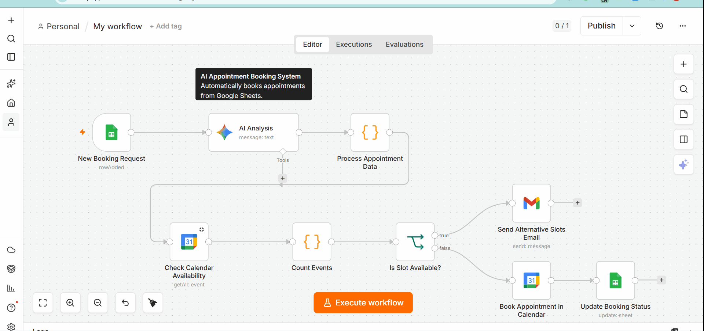

## ✨ Features

- 🤖 **AI-Powered Data Extraction** — Extracts appointment details from unstructured messages
- 📅 **Smart Calendar Checking** — Real-time availability verification before booking
- ✅ **Auto-Booking** — Creates calendar events when slots are available
- 📧 **Alternative Slots Email** — Sends alternative times when requested slot is busy
- 🔄 **Two-Way Sync** — Updates both Google Calendar and Sheets automatically
- ⚡ **Instant Processing** — Under 2 minutes from request to confirmation

## 🛠️ Tech Stack

| Tool | Purpose |
|------|---------|
| **n8n** | Workflow automation engine |
| **Google Gemini AI** | Intelligent data extraction |
| **JavaScript** | Custom date/time processing |
| **Google Calendar** | Event creation and checking |
| **Google Sheets** | Booking request storage |
| **Gmail** | Automated email notifications |

##  Business Impact

| Metric | Before | After |
|--------|--------|-------|
| Booking processing time | 15-30 minutes | < 2 minutes |
| Double-booking errors | 10-15% | 0% |
| Response time | 2-24 hours | Instant |
| Manual hours/week | 5-10 hours | < 30 minutes |

##  How It Works
Google Sheets (New Booking Request)
↓
AI Analysis (Extract appointment details)
↓
JavaScript (Process & format data)
↓
Check Calendar Availability
↓
Count Events (JavaScript)
↓
IF Router (Is Slot Available?)
├─ True → Send Alternative Slots Email
└─ False → Book Calendar → Update Sheet

## 📸 Screenshots

### Full Workflow
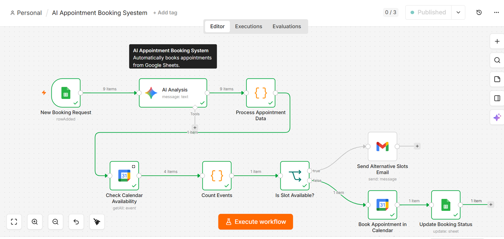

### Google Sheets Trigger
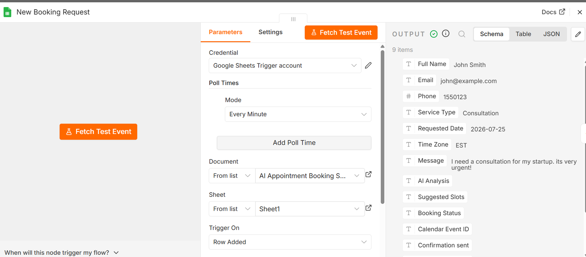

### AI Analysis & Data Extraction
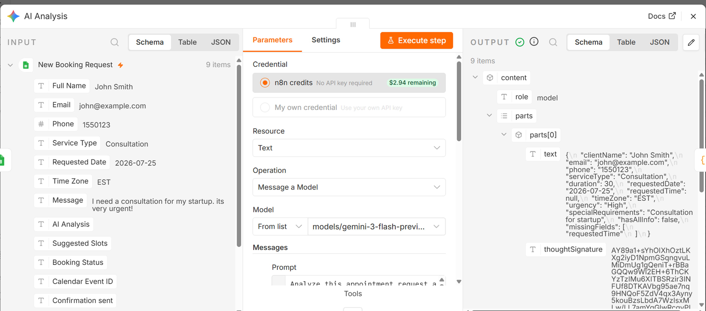

### Process Appointment Data
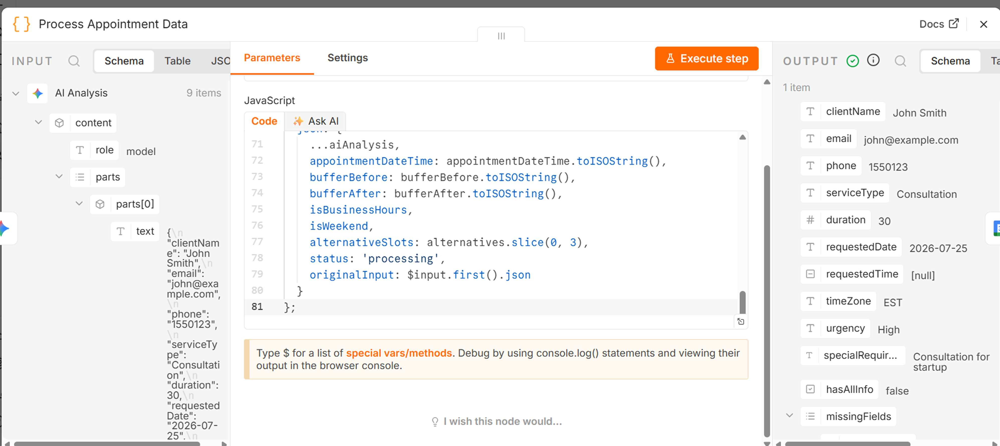

### Check Calendar Availability
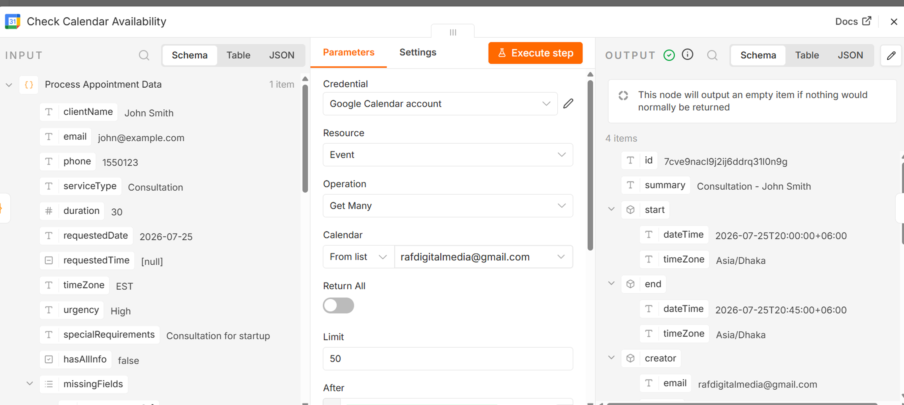

### Count Events Logic
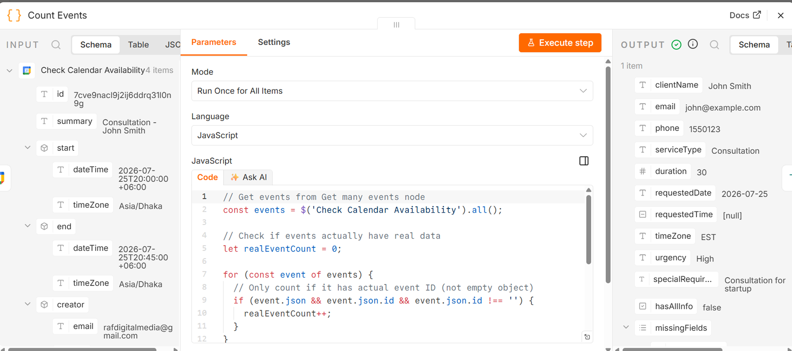

### IF Router - Slot Availability
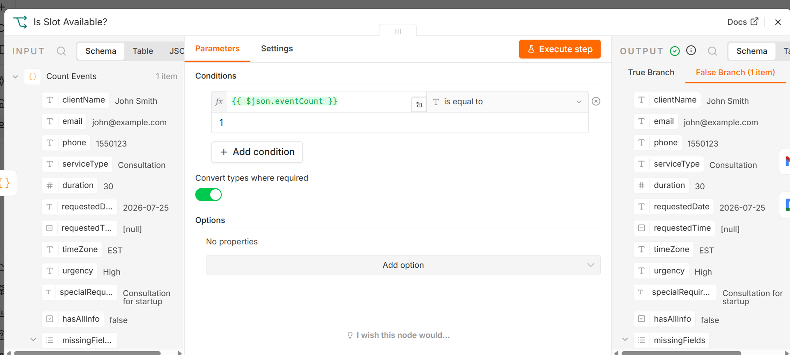

### Send Alternative Slots Email
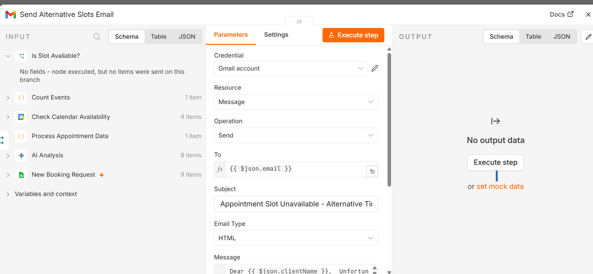

### Book Appointment in Calendar
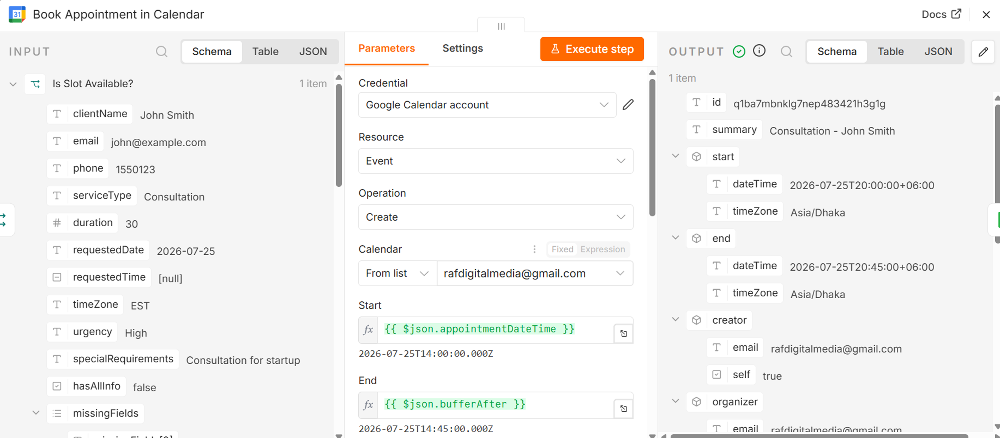

### Update Booking Status
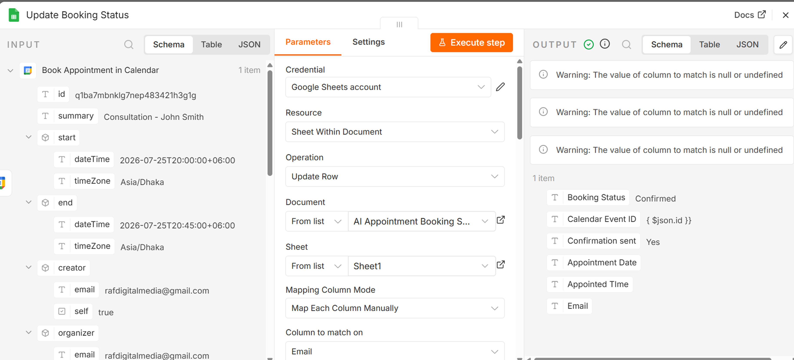

### Calendar Event Created
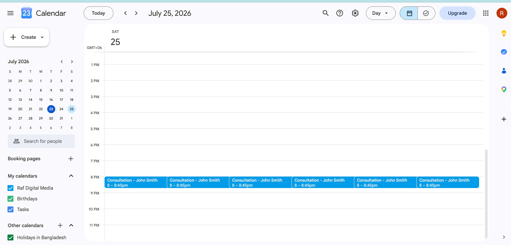

### Updated Sheet Status
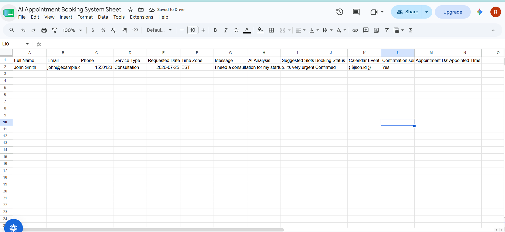

## 📦 Installation

1. Import `AI Lead Qualification.json` to your n8n instance
2. Configure Google Sheets credentials
3. Configure Google Calendar credentials
4. Set up Google Gemini API key
5. Configure Gmail credentials
6. Create Google Sheet with required columns
7. Activate workflow and test!

### Required Google Sheets Columns:
- Full Name
- Email
- Phone
- Service Type
- Requested Date
- Requested Time
- Time Zone
- Message
- Booking Status
- Calendar Event ID
- Confirmation Sent

## 💼 Use Cases

- 🏢 **Consulting Firms** — Automate client appointment scheduling
- 💼 **Service Providers** — Book consultations automatically
-  **Healthcare Clinics** — Manage patient appointments
- 💇 **Salons & Spas** — Handle booking requests 24/7
-  **Tutors & Coaches** — Schedule sessions automatically
- 🏡 **Real Estate Agents** — Book property viewings

## 🔧 Customization

- **Business Hours**: Modify IF condition to check business hours
- **Buffer Time**: Add buffer before/after appointments
- **Email Templates**: Customize alternative slots email
- **AI Prompts**: Adjust for your specific service types

## 📝 License

MIT License — free to use and modify.

---

**Built with ❤️ using n8n and Google AI**
